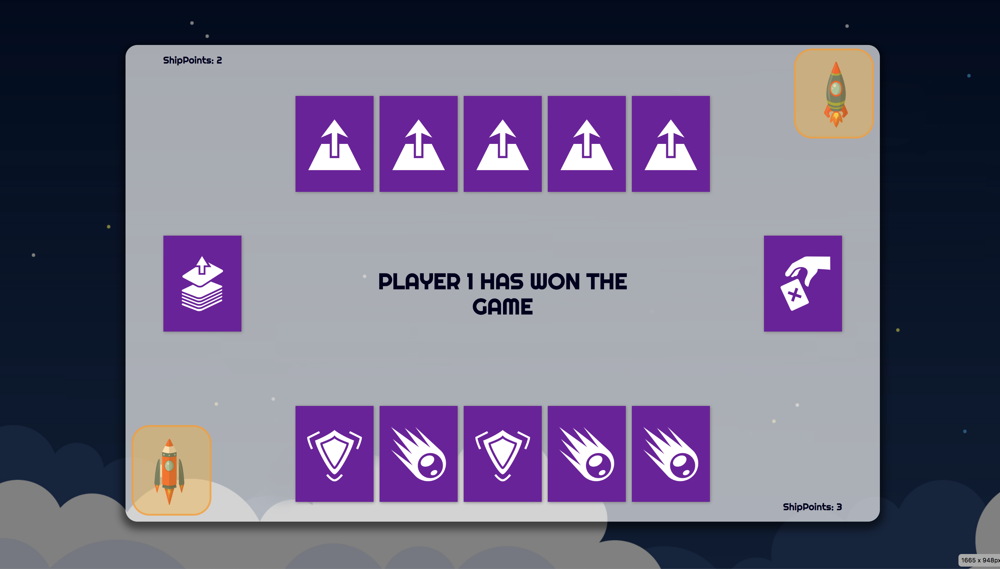

# Space-Dash
A very simple game involving spaceships. The technologies used were HTML, CSS, JS and the JS library Typed.JS.

Instructions:
  - The average user will get on this page
  - The splash screen will load
  - After clicking on the new game button, the user will be introduced to the game story
  - Game is a 2 player game, so another user is needed.
  - the story introduction will load, users will read story.
  - Afterwards, user 1 will click on deck as per instructions
  - User 1 will use cards to get to 3 points. 
  - Both users will read prompt and perform actions accordingly

User Stories: 
- This game is targeted towards teen-aged kids due to the bright colors and easy gameplay, but is not limited to them.

### Major Hurdles

  - I had not realized how DOM-heavy this game required during the thought process, so only most basic features were implemented
  - There are still bugs present that need a refactoring of code to fix.

  #### Link to Game
  http://ortizlu.com/Space-Dash/

  #### Link to Github
  https://github.com/ortizlu/Space-Dash